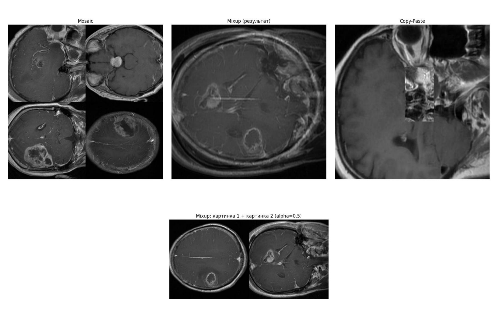

# Brain Tumor Detection with YOLOv8n and YOLOv10n

Object detection and classification of brain tumors in MRI scans using **YOLOv8n** and **YOLOv10n**. The project compares model architectures, optimizers, learning rates, and data augmentation strategies as part of Practical Assignment No. 3 for the **Neural Networks** course at Novosibirsk State Technical University (NSTU).

The detector distinguishes three tumor classes: **glioma**, **meningioma**, and **pituitary tumor**.

## Dataset

The dataset contains annotated brain MRI images in YOLO format and is split into training, validation, and test subsets.

| Split | Images | Share |
|---|---:|---:|
| Train | 2,144 | 70% |
| Validation | 612 | 20% |
| Test | 308 | 10% |

## Technology Stack

- Python
- PyTorch
- Ultralytics YOLO (`YOLOv8n`, `YOLOv10n`)
- OpenCV
- pandas
- matplotlib
- seaborn

## Experimental Methodology

The experiments were performed in three stages:

1. **Optimizer comparison.** SGD, Adam, and AdamW were evaluated on both YOLOv8n and YOLOv10n. Training used 30 epochs and a batch size of 4.
2. **Hyperparameter search.** After the optimizer comparison, SGD and AdamW were retained for further experiments. The search compared combinations of optimizer and initial learning rate (`lr0`).
3. **Data augmentation comparison.** Four augmentation configurations were evaluated: no augmentation, standard Ultralytics augmentations with MixUp, standard augmentations with Copy-Paste, and standard augmentations only.

Performance was evaluated using **Precision (P)**, **Recall (R)**, **mAP@50**, **mAP@50–95**, and normalized confusion matrices.

## Results

### 1. Optimizer Comparison

#### YOLOv8n

| Optimizer | P | R | mAP@50 | mAP@50–95 |
|---|---:|---:|---:|---:|
| SGD | 0.858 | 0.821 | 0.882 | 0.650 |
| Adam | 0.809 | 0.855 | 0.890 | 0.632 |
| AdamW | 0.855 | 0.869 | **0.907** | **0.676** |

#### YOLOv10n

| Optimizer | P | R | mAP@50 | mAP@50–95 |
|---|---:|---:|---:|---:|
| SGD | 0.858 | 0.780 | **0.870** | **0.642** |
| Adam | 0.808 | 0.802 | 0.851 | 0.633 |
| AdamW | 0.814 | 0.803 | 0.864 | 0.635 |

Adam was excluded from the following experiments because it produced intermediate results on both architectures, while SGD and AdamW provided a more informative comparison between different optimization strategies.

### 2. Hyperparameter Search

The search compared SGD and AdamW with `lr0` values of `0.01`, `0.001`, and `0.0001`.

| Model | Best Configuration | Best mAP@50 |
|---|---|---:|
| YOLOv8n | SGD, `lr0=0.01` | **0.9164** |
| YOLOv10n | AdamW, `lr0=0.001` | **0.8819** |

Under the experimental setup used in this work, YOLOv8n achieved its highest mAP@50 with SGD and a higher initial learning rate, whereas YOLOv10n achieved its best result with AdamW and `lr0=0.001`.

### 3. Data Augmentation

Four augmentation configurations were tested. The standard Ultralytics augmentation set used in the experiments included:

- `hsv_h` — random hue adjustment
- `hsv_s` — random saturation adjustment
- `hsv_v` — random brightness/value adjustment
- `translate` — random translation
- `scale` — random scaling
- `fliplr` — horizontal flipping
- `mosaic` — combination of four images into one training sample

Two additional strategies were evaluated separately:

- `mixup=0.5` — combines two images into a blended training sample
- `copy_paste=0.5` — copies an object from one image and pastes it into another image

#### Augmentation examples

The figure below shows examples produced during the laboratory work: **Mosaic**, **MixUp**, and **Copy-Paste**, together with an additional MixUp example.



#### Augmentation Results

| Configuration | YOLOv8n mAP@50 | YOLOv10n mAP@50 |
|---|---:|---:|
| No augmentations | 0.858 | 0.785 |
| Standard + MixUp | **0.921** | 0.841 |
| Standard + Copy-Paste | 0.908 | 0.841 |
| Standard only | 0.908 | **0.853** |

For **YOLOv8n**, the best augmentation configuration was the standard augmentation set combined with MixUp, increasing mAP@50 from 0.858 without augmentation to 0.921. For **YOLOv10n**, the highest mAP@50 in the reported results was obtained with the standard augmentations only (0.853).

## Best YOLOv8n Configuration

The strongest result obtained in the experiments was produced by:

**YOLOv8n + SGD + `lr0=0.01` + standard augmentations + MixUp**

| Class | P | R | mAP@50 | mAP@50–95 |
|---|---:|---:|---:|---:|
| All | 0.869 | 0.848 | **0.921** | 0.666 |
| Glioma | 0.771 | 0.673 | 0.830 | 0.471 |
| Meningioma | 0.924 | 0.952 | 0.970 | 0.811 |
| Pituitary | 0.911 | 0.920 | 0.964 | 0.717 |

Glioma was the most difficult class for the final YOLOv8n configuration, with lower recall and mAP values than meningioma and pituitary tumors.

## Conclusions

The experiments show that the choice of optimizer, learning rate, and augmentation strategy has a substantial effect on detection performance. YOLOv8n produced the highest overall result in this experimental setup. Its best configuration reached **mAP@50 = 0.921** using SGD with `lr0=0.01` and standard augmentations combined with MixUp.

YOLOv10n produced lower mAP@50 values within the same experimental budget. Its best hyperparameter-search result was obtained with AdamW and `lr0=0.001`, while its best reported augmentation experiment used the standard augmentation set without MixUp or Copy-Paste.

## Repository Structure

```text
├── train.py
├── readme_assets/
│   └── augmentations.png
└── README.md
```

`train.py` contains model training, validation, metric visualization, and experimental code used in the laboratory work.

## Running the Project

Install the required dependencies:

```bash
pip install ultralytics opencv-python pandas matplotlib seaborn torch
```

Run the training script:

```bash
python train.py
```

The dataset must be prepared in **YOLO format**, including a `data.yaml` file and `train`, `val`, and `test` directories containing the corresponding images and annotations.
